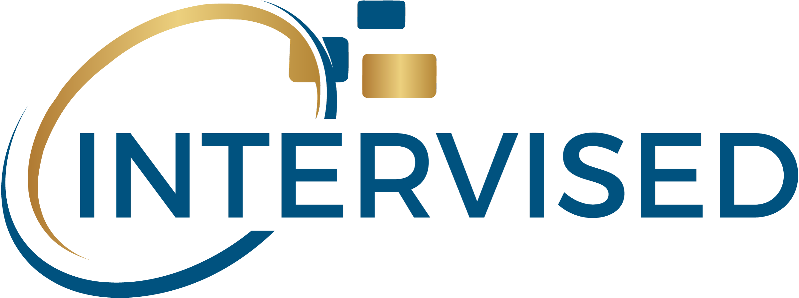

[![Contributors][contributors-shield]][contributors-url]
[![Forks][forks-shield]][forks-url]
[![Stargazers][stars-shield]][stars-url]
[![Issues][issues-shield]][issues-url]
[![MIT License][license-shield]][license-url]
[![LinkedIn][linkedin-shield]][linkedin-url]

<!-- PROJECT LOGO -->
 

  

<h3 align="center">Beginner Projects</h3>

  

    Side & Beginner projects I made from the start to now
     
    <a href="https://github.com/princejonaa/Beginner-Projects"><strong>Documentation »</strong></a>
     
     
    <a href="https://github.com/princejonaa/Beginner-Projects">View Demo</a>
    ·
    <a href="https://github.com/princejonaa/Beginner-Projects/issues">Report Bug</a>
    ·
    <a href="https://github.com/princejonaa/Beginner-Projects/issues">Request Feature</a>
  

<!-- TABLE OF CONTENTS -->

  
Table of Contents

  <ol>
    <li>
      <a href="#about-the-project">About The Project</a>
      <ul>
        <li><a href="#Language-Used">Languages Used</a></li>
      </ul>
    </li>
    <li>
      <a href="#Projects">Projects</a>
      <ul>
        <li><a href="#prerequisites">Prerequisites</a></li>
      </ul>
    </li>
    <li><a href="#usage">Usage</a></li>
    <li><a href="#roadmap">Roadmap</a></li>
    <li><a href="#contributing">Contributing</a></li>
    <li><a href="#license">License</a></li>
    <li><a href="#contact">Contact</a></li>
    <li><a href="#acknowledgments">Acknowledgments</a></li>
  </ol>

<!-- ABOUT THE PROJECT -->
## About The Project

Hey! This is a few projects I made starting in November. I don't know where this is going to end up but I just like to code and I look forward to just expanding my learning.

(<a href="#top">back to top</a>)

### Language Used

* [React.js](https://reactjs.org/)
* [Bootstrap](https://getbootstrap.com)
* [JQuery](https://jquery.com)
* [CSS](https://www.w3.org/TR/CSS/#css)
* [HTML](https://html.spec.whatwg.org)
* [JavaScript](https://www.ecma-international.org/publications-and-standards/standards/ecma-262/)

(<a href="#top">back to top</a>)

<!-- Projects -->
## Projects

Project 1: Dark Mode / Light Mode Button: Learning HTML, JS, Javascript. First project after doing Dash & using Mimo for 2-3 days.

### Prerequisites

Will be stated in the folder of each project made.

### Installation

Will be stated in the folder of each project made.

(<a href="#top">back to top</a>)

<!-- USAGE EXAMPLES -->
## Usage

This is a simple reference guide for all of my work as a student and maybe further. Feel free to use as you wish unless directly stated.

(<a href="#top">back to top</a>)

<!-- ROADMAP -->
## Roadmap

- [x] Project 1 
- Project 2
- Project 3

See the [open issues](https://github.com/princejonaa/Beginner-Projects/issues) for a full list of proposed features (and known issues).

(<a href="#top">back to top</a>)

<!-- CONTRIBUTING -->
## Contributing

Contributions are what make the open source community such an amazing place to learn, inspire, and create. Any contributions you make are **greatly appreciated**.

If you have a suggestion that would make this better, please fork the repo and create a pull request. You can also simply open an issue with the tag "enhancement".
Don't forget to give the project a star! Thanks again!

1. Fork the Project
2. Create your Feature Branch (`git checkout -b feature/AmazingFeature`)
3. Commit your Changes (`git commit -m 'Add some AmazingFeature'`)
4. Push to the Branch (`git push origin feature/AmazingFeature`)
5. Open a Pull Request

(<a href="#top">back to top</a>)

<!-- LICENSE -->
## License

Distributed under the MIT License. See `LICENSE.txt` for more information.

(<a href="#top">back to top</a>)

<!-- CONTACT -->
## Contact

Jonathan - [@PrinceJonaa](https://twitter.com/PrinceJonaa)

Project Link: [https://github.com/princejonaa/Beginner-Projects](https://github.com/princejonaa/Beginner-Projects)

(<a href="#top">back to top</a>)

<!-- ACKNOWLEDGMENTS -->
## Acknowledgments

* To be announced

(<a href="#top">back to top</a>)

<!-- MARKDOWN LINKS & IMAGES -->
<!-- https://www.markdownguide.org/basic-syntax/#reference-style-links -->
[contributors-shield]: https://img.shields.io/github/contributors/princejonaa/Beginner-Projects.svg?style=for-the-badge
[contributors-url]: https://github.com/princejonaa/Beginner-Projects/graphs/contributors
[forks-shield]: https://img.shields.io/github/forks/princejonaa/Beginner-Projects.svg?style=for-the-badge
[forks-url]: https://github.com/princejonaa/Beginner-Projects/network/members
[stars-shield]: https://img.shields.io/github/stars/princejonaa/Beginner-Projects.svg?style=for-the-badge
[stars-url]: https://github.com/princejonaa/Beginner-Projects/stargazers
[issues-shield]: https://img.shields.io/github/issues/princejonaa/Beginner-Projects.svg?style=for-the-badge
[issues-url]: https://github.com/princejonaa/Beginner-Projects/issues
[license-shield]: https://img.shields.io/github/license/princejonaa/Beginner-Projects.svg?style=for-the-badge
[license-url]: https://github.com/princejonaa/Beginner-Projects/blob/master/LICENSE.txt
[linkedin-shield]: https://img.shields.io/badge/-LinkedIn-black.svg?style=for-the-badge&logo=linkedin&colorB=555
[linkedin-url]: https://linkedin.com/in/jonathan-bonner-professional
[product-screenshot]: images/screenshot.png